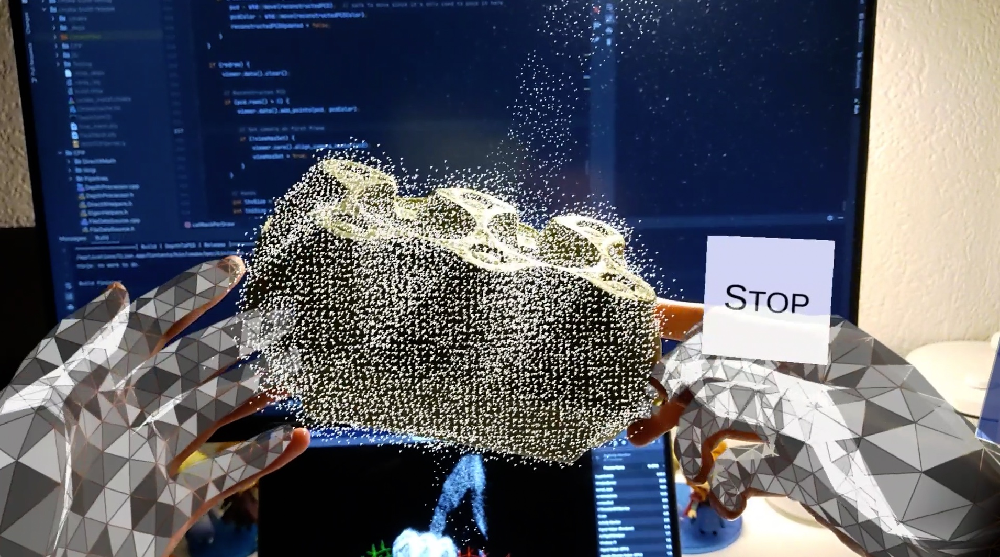
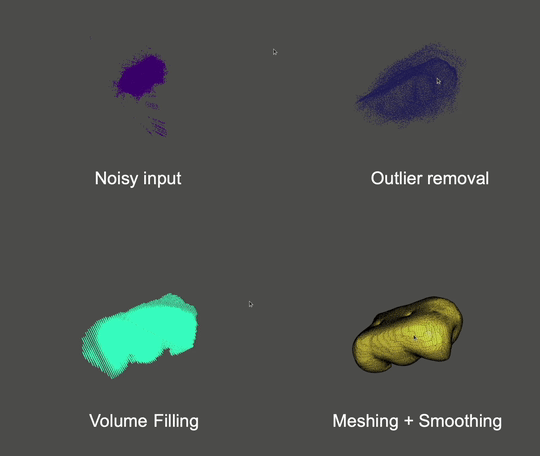
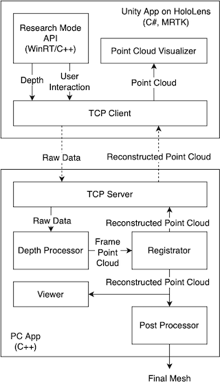

HoloScanner: In-Hand Scanning with HoloLens 2 for Irregular Geometries
======================================================================

An end-to-end system for in-hand scanning and near-real-time reconstruction of irregular geometries based on Microsoft
HoloLens 2. Group project of ETHZ Mixed Reality HS2022 by:

* Zikai Liu (liuzik@student.ethz.ch)
* Dumeni Manatschal (dumenim@student.ethz.ch)
* Noureddine Gueddach (ngueddach@student.ethz.ch)
* Mingyuan Chi (minchi@student.ethz.ch)

Supervised by Andrea Settimi (andrea.settimi@epfl.ch).

This repo contains all the code of the system. For more recent updates and extensions to each parts, please check:
* Unity app and the scanning server program: [liuzikai/HoloScanner](https://github.com/liuzikai/HoloScanner)
* Post-processing program: [Vellyxenya/mr_postprocess](https://github.com/Vellyxenya/mr_postprocess).

This project is built upon [HoloLens2-ResearchMode-Unity](https://github.com/petergu684/HoloLens2-ResearchMode-Unity).





## System Architecture



## The Unity App Running on HoloLens

Requirements:

* Unity 2019.4.22f1 on **Windows**.
    * Unity up to 2021.1 may also work, but 2021.2 or later does not due to the reason explained
      in [UnitySample/README.md](UnitySample/README.md).
    * UWP application is not available for Unity on macOS or Linux.
* Visual Studio **2019** and required components based
  on [the HoloLens tutorial](https://learn.microsoft.com/en-us/windows/mixed-reality/develop/install-the-tools?tabs=unity).
    * Up to 2022.10.17, VS 2022 did not work (on Win 11 ARM), showing “missing C++ workload component” error.
      This [issue](https://github.com/microsoft/MixedRealityToolkit-Unity/issues/10647) might be related.
* HoloLens 2 with firmware **21H2 - March 2022 (Build 20348.1450)**.
    * Up to 2022.10.25, the latest firmware of HoloLens 2 had broken Research Mode API, causing the app to crash on
      start. This [issue](https://github.com/microsoft/HoloLens2ForCV/issues/133) might be related. To downgrade the
      firmware, follow
      [this tutorial](https://learn.microsoft.com/en-us/hololens/hololens-recovery#normal-flashing-procedure),
      using
      the [Advanced Recovery Companion](https://apps.microsoft.com/store/detail/advanced-recovery-companion/9P74Z35SFRS8?hl=en-us&gl=us).
      Remember to disable auto update in Settings after downgrading (you can disable update for up to 30 days, so
      remember to do
      this regularly).

Open the Unity project [UnitySample](UnitySample) in the Unity editor. Follow the instruction
in [UnitySample/README.md](UnitySample/README.md).

Based on the original project, we extend the app with the ability to stream data to the server and to visualize point
cloud streamed back. We also update the UI (eye tracking button to start/stop scanning, hand mesh, etc.)

Note:

* Compiling and deploying the Unity project takes a while (5-10 min). Machines with better performance are desirable.
  Code wrapped in `#if WINDOWS_UWP` and `#if ENABLE_WINMD_SUPPORT` does not compile when the editor loads the scripts (
  necessary, or it does not compile in the editor). But when actually building the app, those code compiles, so only
  until then you may get more errors. To save time, double-check the code (like missing semicolons) before compiling.
* Build + deploy with the device portal in Unity Build Settings is typically the fastest way. In Unity 2019.4.22f1, the
  textbox of the device portal password behaves weirdly, especially after refreshing the scripts. If it shows the
  error message of "not able to connect to the device", try to re-type the password. The generated VS project can
  also be opened and built, but VS debugging and Unity debugger do not work (see Known Issues below).

### HoloLens Research Mode Plugin

The HoloLens Research Mode API is only available in C++. To use the API in Unity/C#, a Windows Runtime (WinRT)
Component ([HL2UnityPlugin](HL2UnityPlugin)) is created. The plugin is compiled into a DLL as a plugin in Unity.

A compiled plugin is already in the Unity project (dll and winmd
in [UnitySample/Assets/Plugins/WSA/ARM64](UnitySample/Assets/Plugins/WSA/ARM64)).
If the plugin is modified, it needs to be recompiled and copied to the Plugin directory.
See [HL2UnityPlugin/README.md](HL2UnityPlugin/README.md) for instructions.

Based on the original project, we extend the plugin with another module HL2Interactions, which acquires the user
interaction data (hand tracking, head tracking, eye gaze, etc.). We also extend the HL2ResearchMode module to acquire
the AHAT extrinsic matrix and depth look-up table (LUT).

Note:

* In the original project, `_XM_NO_INTRINSICS_` was used for DirectXMath. It is changed to `_XM_ARM_NEON_INTRINSICS_`.

## The Server App Running on PC

The repo contains Git submodules. To check out the submodules:

```shell
git submodule update --init
```

Build requirements:

* CMake
* Boost (1.80.0 or so)
* Open3D
    * For macOS and Windows, compile from
      source: [Build from source — Open3D 0.16.0 documentation](http://www.open3d.org/docs/release/compilation.html)
* OpenGL & libIGL

The current branch is tested on macOS Apple Silicon with Clang. For Windows with MSVC, some more modifications might be
needed. For example:

* `target_compile_options(DepthToPCD PRIVATE "/MT$<$<CONFIG:Release>:>")` to correctly link the Open3D library.
* Directory to Boost and Open3D may need to be specified in order to be found.
* [CPP/DirectXMath/Inc/sal.h](CPP/DirectXMath/Inc/sal.h) and [unsal.h](CPP/DirectXMath/Inc/sal.h) (as well
  as `#include "unsal.h"` at the end of [DirectXMath.h](CPP/DirectXMath/Inc/DirectXMath.h)) needs to be removed
  for Windows. According to [Microsoft/DirectXMath](https://github.com/microsoft/DirectXMath), sal.h is needed for Linux
  and macOS. However, for Ubuntu, macros defined inside pollutes the standard library. Therefore, we add an unsal.h to
  undef them. For Windows, such changes should be undone.

See the other branches for reference.

To build the program:

```shell
mkdir build
cd build
cmake -DCMAKE_BUILD_TYPE=Release ..
make DepthToPCD
```

Ninja also works.

Optionally to specify a data directory to store scanning results other than the default "../data",
add `-DDATA_FOLDER=...` to CMake command line argument.

## System Usage

=> [Demo video](https://polybox.ethz.ch/index.php/s/QPejCiHCGQGyyPG)

* Build and deploy the Unity App to HoloLens.
* Start the app (HL2ResearchMode with a Unity icon) once. It will request for permissions. Allow all and **restart**
  the app.
* The menu can be dragged and dropped.
* Use "Toggle Point Cloud" to switch between local per-frame point cloud and reconstruction results. Notice that
  per-frame
  point cloud is not equal to what being seen at scanning. For example, an object being too close or too far may have no
  points received (see Known Issue below). The local point cloud is used to evaluate the environment noise (e.g.
  ["aliased depth"](https://github.com/microsoft/HoloLens2ForCV/issues/12) of the AHAT sensor).
* Compile and start the server. The server must be in the same network as the client (type-C connection works as an
  ethernet, or in the same WiFi) and has **one of the fixed IPs** in the `hostIPAddresses` of TCPClient of the Unity
  app, which is set in the Unity Editor. The current accepted IPs (former ones take higher priority) are:
    * 169.254.41.190
    * 192.168.1.108
    * 192.168.1.107
    * 192.168.155.61
* Click "Connect to the Server". The LED should turn green if succeeds.
* Hold the object with **both hands** in front of the HoloLens. Adjust the distance to the HoloLens as needed.
* Look at the Start button to start scanning (try not to turn your head too much).
* Wait for a while. Once the scanning starts, the reconstructed point cloud overlaps on the Object. Due to the algorithm
  being used for registration, the scanning should have a good starting point. If that is not the case, restart the
  scanning or even restart the server. If the server restarts, the client needs to disconnect and reconnect.
* If you see hands jumping in the HoloLens, that means HoloLens has problem tracking your hands and the frame gets
  dropped. Do not proceed and adjust your hand gestures until they become stable. Not both hands need to hold on to the
  object, but both must be visible to the HoloLens.
* If you see the point cloud turn orange, it means the registration fails. Do not proceed and realign the object with
  the point cloud until it becomes white again.
* Once all faces are scanned. Stop scanning using the eye-tracking button. A folder named as the current timestamp is
  created in the Data Folder and the final point cloud is stored.

## Known Issues

* Depth filtering based on hand position does not work when the object is getting too close or too far from the
  HoloLens, although the depth clipping range seems right.
* While doing the scanning, very fast movement of the object causes the registration to lose tracking. An orange point
  cloud is sent to the HoloLens, but then the TCP connection seems corrupted and cannot be automatically recovered with
  the state machine in UnitySample/Assets/Scipts/TCPClient.cs. This seems not to happen when the point cloud normally
  loses tracking.
* The Unity application sometimes crashes. The issue is unknown yet. When debugging in VS, exceptions are thrown in GC
  code but the root cause has not yet been located.
* Deployment build of Unity + VS Unity debugger does not work. Viewing from the log, the debugger seems not to start on
  HoloLens. The issue is unknown yet.
* Eye tracking data streaming from HL2UnityPlugin/HL2Interactions to TCPDataSource is not tested yet.
* class FileSystemSource is out of maintenance.
* To limit the bandwidth usage of streaming raw data to the server, only every `rawDataDownSampleFactor`
  frames ([ResearchModeVideoStream.cs](UnitySample/Assets/Scipts/ResearchModeVideoStream.cs)) is sent. Currently, the
  processing bandwidth is < 10 frame per seconds, and exceeded frames are dropped at the server anyway. But if a higher
  processing frame rate is achieved, this number should be decreased accordingly.
* Apple Silicon Mac seems to have problems scheduling the Open3D algorithms. Sometimes the CPU usage is far less than
  100% (not even a single core) and the processing frame rate is extremely low. The cause is unknown yet. Running a VM
  at the same time seems to solve the problem (reaching 500% CPU usage) but the solution is not confirmed yet. A
  possible reason is the out-of-date OpenMP library being used when compiling Open3D (newer version is not supported).

## License

The code is released under the MIT license.